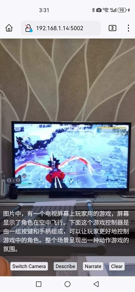
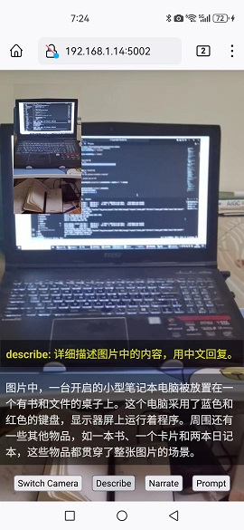
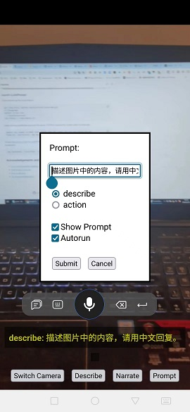

# LLaVaPrompt






## Getting Started

You will need a machine with about ~9 GB of RAM/VRAM for the q4_k version.

### Set up the llama.cpp server

(Optional) Install the CUDA toolkit:

```shell
sudo apt install nvidia-cuda-toolkit
```

Build llama.cpp (build instructions for various platforms at [llama.cpp build](https://github.com/ggerganov/llama.cpp#build)):

```shell
git clone https://github.com/ggerganov/llama.cpp
cd llama.cpp
mkdir build
cd build
cmake .. -DLLAMA_CUBLAS=ON # Remove the flag if CUDA is unavailable
cmake --build . --config Release
```

Download the models from [ggml_llava-v1.5-13b](https://huggingface.co/mys/ggml_llava-v1.5-13b/tree/main):

```shell
wget https://huggingface.co/mys/ggml_llava-v1.5-13b/resolve/main/mmproj-model-f16.gguf
wget https://huggingface.co/mys/ggml_llava-v1.5-13b/resolve/main/ggml-model-q4_k.gguf # Choose another quant if preferred
```

Start the server (server options detailed [here](https://github.com/ggerganov/llama.cpp/blob/master/examples/server/README.md)):

```shell
./bin/server -m ggml-model-q4_k.gguf --mmproj mmproj-model-f16.gguf -ngl 35 -ts 100,0 # For GPU-only, single GPU
# ./bin/server -m ggml-model-q4_k.gguf --mmproj mmproj-model-f16.gguf # For CPU
```

### Launch LLaVaPrompt

Clone and set up the environment:

```shell
git clone https://github.com/bluishfish/llavaprompt.git
cd llavaprompt
python3 -m venv venv
. ./venv/bin/activate
pip install -r requirements.txt
```

Create dummy certificates and start the server. HTTPS is required for mobile video functionality:

```shell
openssl req -newkey rsa:4096 -x509 -sha256 -days 365 -nodes -out cert.pem -keyout key.pem
flask run --host=0.0.0.0 --key key.pem --cert cert.pem --debug
```

Access https://your-machine-ip:5000 from your mobile device. Optionally, start a local tunnel with ngrok or localtunnel:

```shell
npx localtunnel --local-https --allow-invalid-cert --port 5000
```

## Acknowledgements and Inspiration
- [lxe/llavavision](https://github.com/lxe/llavavision)
- [Fuzzy-Search/realtime-bakllava](https://github.com/Fuzzy-Search/realtime-bakllava)
- [Multimodal LLama.cpp](https://github.com/ggerganov/llama.cpp/issues/3332)
- [llava-vl.github.io](https://llava-vl.github.io/)
- [SkunkworksAI/BakLLaVA-1](https://huggingface.co/SkunkworksAI/BakLLaVA-1)
